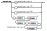

# Librairie Melody

Cette librairie instaure un système de notation simple mais complet, appelé MELO, afin d'écrire des mélodies (suite de notes musicales à une seule voix) dans le but de faciliter le pont entre la notation musicale et la génération du son.

## Raison d'être de la librairie

D'un côté, la notation musicale permet d'écrire une suite de notes, selon des standards connus depuis longtemps; on y utilise des lettres et des symboles afin de nommer les notes, spécifier des changements de rythmes ou des altérations (dièses, bémols), ou même des répétitions.

De l'autre côté, la génération d'un son avec Arduino (habituellement à l'aide d'un buzzer), doit plutôt être exprimé par la fréquence du son (en Hz), sa durée (en millisecondes) et son intensité sonore (qui dépend du matériel utilisé).

En tant que musicien, écrire de la musique pour Arduino, en terme de Hz et de millisecondes est définitivement un frein et alourdit l'écriture, tout en ne mettant pas à profit la notation musicale déjà très riche. La librairie Melody vient faire le pont entre les deux.

## La notation MELO

La notation MELO (pour Melody) est un format textuel qui permet l'écriture simplifié d'une mélodie à une voix. Cette notation s'inspire notamment de la notation musicale standard.

### Mélodie

La mélodie est la forme de base de la notation. Elle est formée d'une suite de note ou de groupe de notes, suivi de modificateur. On peut espacer ou non ces suites de notes ou groupes. Chaque modifieur viendra modifier la note ou le groupe de notes qui le précède.


#### Exemples

- "cdefgab"
- "c d e f  g a b"
- "c_ c c*"
- "c\* d\* e\* f\*" est équivalent à "(cdef)\*"

### Note

Une note est représenté par une lettre (majuscule ou minuscule), selon la nomenclature standard C (do), D (ré), E (mi) F (fa), G (sol), A (la), B (si). On ajoute également la lettre R (rest) pour les silences. Par défaut, les notes sont celles de la 4e octave, où la note LA est de fréquence 440 Hz; elles ont toutes une durée relative de 1.


#### Exemples

- "c d r" est équivalent à "C D R"

### Group

Un groupe permet facilement d'appliquer un modifieur à toute une mélodie d'un seul coup, afin d'alléger l'écriture. Un groupe est délimité par une paire de parenthèses.


### Modifier

Un modifieur est une suite d'altération qui permet de modifier la hauteur, la durée, le nombre de répétition ou l'intensité sonore d'une note ou d'un groupe de notes. On peut spécifier plusieurs modifieurs de suite; ils ont la propriétés d'être commutatif, c'est-à-dire que l'ordre dans lequel on les écrit n'aura pas d'importance.


#### Exemples
- c+
- c+.
- d*
- d,
- d**
- d

### Pitch

Un modifieur de hauteur du son permet d'augmenter ou d'abaisser une note d'un demi-ton ou d'un octave.


### Duration

Un modifieur de durée permet de multiplier la durée d'une note par un facteur simple (2, ½ ou ¾); il permet aussi de spécifier plus précisément n'importe quel type de pondération du temps (par exemple, pour les triolets). Par défaut, les notes ont toutes une durée de 1.



### Repetition

Un modifieur de répétition permet de spécifier un nombre de répétition consécutifs pour la note ou le groupe de notes concernés.


### Loudness

Un modifieur d'intensité sonore permet d'augmenter ou de diminuer la force du son. Une note a, par défaut, une intensité de 0; on peut donc avec des valeurs positives ou négatives. Puisque l'intensité sonore réelle dépend du matériel utilisé, il est suggéré d'utiliser une échelle relative allant de -3 (ppp) à +3 (fff).


### Integer

Un nombre entier doit être strictement positif (ne peut pas valoir zéro).


### Space

Les espaces permis incluent les caractères couramment utilisé comme espaceur; on y ajoute la barre verticale '|', car elle est souvent utilisée en notation musicale pour repérer les mesures et faciliter la lecture. Ces espaces sont facultatifs.


## Utilisation

```cpp
#include <Melody.h>

const uint8_t PIN_BUZZER = 12;

Melody melody(PIN_BUZZER);


void setup() {
  melody.setScore("c d e f g a c*");  //May be changed whenever you want
  melody.setTempo(120);               //May be changed whenever you want
}

void loop() {
 

  melody.restart();

  while(melody.hasNext()){
    melody.next();

    unsigned int freq = melody.getFrequency(); 
    unsigned long duration = melody.getDuration();
    unsigned int loudness = melody.getLoudness();

    freq > 0 ? tone(freq) : noTone();

    delay(duration);
    // loudness could be use with a mapping, according to your buzzer or sound-producing hardware
    //For Example :
    /*
      { 
        int realIntensity = map(loudness, -3, 3, 0, 1024);
        myBuzzer.setIntensity(realIntensity);
      }


    */

  }
}

```

## Constructeurs
```cpp
Melody();
```

---
```cpp
void setTempo(unsigned int tempo)
int getTempo()
```
Cette méthode permet de lire et modifier le tempo de la musique, qui correspond au nombre de temps musicaux durant une minute. Par exemple, un tempo de 120 signifie qu'il y aura 120 notes de 1 temps joué durant 1 minute - ou que chaque note durera 0.5 seconde.

---
```cpp
void setScore(char *score)
char *getScore()
```
Cette méthode permet de lire et modifier le score du Melody, soit une chaîne de texte formaté selon la notation expliquée à la section 'Notation musicale'.
