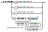
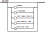

**La version en français est disponible plus bas.**

# Melody library


This library sets up a simple but complete notation system, called MELO, in order to write melodies (a series of musical notes in a single voice) in order to facilitate the bridge between musical notation and sound generation.


## Motivations for the library

On the one hand, musical notation makes it possible to write a series of notes, according to standards known for a long time; letters and symbols are used to name notes, to specify rhythm changes or alterations (sharps, flats), or even repetitions.

On the other hand, the generation of a sound with Arduino (usually using a buzzer), should rather be expressed by the frequency of the sound (in Hz), its duration (in milliseconds) and its loudness (which depends on the material used).

As a musician, writing music for Arduino, in terms of Hz and milliseconds is definitely a drag and weighs down writing, while not taking advantage of the already rich musical notation. The Melody library is the bridge between the two.

## The MELO notation

The MELO notation (MELO stands for Melody) is a textual format which allows the simplified writing of a melody of a single voice. This notation is notably inspired by standard musical notation.

## Examples

#### C scale
```
" c d e f g a b c* "
```


#### Wolfgang Amadeus Mozart, Eine kleine Nachtmusik (KV 525):

```
"g<<r-d- | g<< r-d-(g<dg<b)-d<*r | c*<<r-a-c*<<r-a- |(c*<af#<a)-d<r | (gr)- g. (bag | (gag)/3:1 f#)- f#. (ac*f# | ag)- g.  (bag | (gag)/3:1 f#)- f#. (ac*f#)- | ((grgr)-- (gf#ef#)--)>> ((grgr)-- (baga)--)> | (brbr)-- (d*c*bc*)-- d*< r | ((de)+  | (d-c.)-c (c-b_.)-  b_ | (( b-a.)- a (gf#ef# | (grarbr)>)- r )_)> "

```
#### Au Clair de la Lune (french song)
```
" (cccde+d+  ceddc++)x2  |  dddd (aa)+_ dc(b a g++)_  |  cccde+d+ ceddc++ "
```

## MELO notation rules

### A sequence

A sequence is the basic form of the MELO notation. It is made up of a series of notes or groups of notes, followed by a modifier. You can space these series of notes or groups apart or not. Each modifier will modify the note or the group of notes that precede it.


#### Examples

- "cdefgab"
- "c d e f  g a b"
- "c_ c c*<"
- "(cdef)\*" is equivalent to "c\* d\* e\* f\*"

### Note

A note is represented by a letter (uppercase or lowercase), according to the standard nomenclature C (do), D (ré), E (mi) F (fa), G (sol), A (la), B (si) . We also add the letter R (rest) for the rests. By default, the notes are those of the 4th octave, where the note A is of frequency 440 Hz; they all have a relative duration of 1, corresponding to a 'quarter note' in standard musical notation.


#### Examples

- "c d r" is equivalent to "C D R"

### Group

A group makes it easy to apply a modifier to an entire sequence at once, in order to lighten the writing. A group is delimited by a pair of parentheses.


#### Examples
- "(cde)#" is equivalent to "c# d# e#"
- "(efg)\*-" is equivalent to "e\*- f\*- g\*-"
- "((abc#)-)x2  is equivalent to " a- b- c#- a- b- c#-"

### Modifier

A modifier is a sequence of alterations that allows you to modify the pitch, duration, number of repetitions or loudness of a note or group of notes. You can specify several modifiers in a row; they have the properties of being commutative, that is to say that the order in which they are written will not matter.


#### Examples
- "c+"  c, 2 times longer
- "(cde)x3"  is equivalent to  "cdecdecde"
- "d#"  d, one semitone higher
- "e_"  mi, one octave lower
- "a*_" a without any modification, since the effect of 'one octave lower' is cancelled by 'one octave higher'
- "b,>+" b, one semitone lower, 2 times longer, and softer

### Pitch

A pitch modifier lets you raise or lower a note by a semitone or an octave.


- "c#"  c, one semitone higher
- "d*"  d, one semitone lower
- "e*"  e,  one octave higher
- "f_"  f,  one octave lower

### Duration

A duration modifier allows you to multiply the duration of a note by a simple factor (2, 1/2 or 3/2); it also allows you to specify more precisely any type of time weighting (for example, for triplets). By default, all notes have a duration of 1.



- "c+"  c, 2 times longer, equivalent to an half note
- "c-"  c 2 times shorter, equivalent to an eighth note
- "c."  c, 1.5 times longer, equivalent to an quarter note + an eighth note.
- "(ccc)/3:1" equivalent to a triplet of c, (three notes of 1/3 the duration of one quarter note) 

### Repetition

A repeat modifier allows you to specify a number of consecutive repetitions for the note or group of notes concerned.


- "(cde) x 3" equivalent to "cdecdecde"
- "( a X2 ef)x2" equivalent to "aaefaaef"

### Loudness

A sound intensity modifier allows you to increase or decrease the strength of the sound. A note has, by default, an intensity of 0; we can therefore go there with positive or negative values. Since the actual loudness depends on the hardware used, it is suggested to use a relative scale ranging from -3 (really really soft, or *ppp*) to +3 (really really loud, or *fff*).


- "c>>>" c, really really soft (*ppp*), loudness = -3
- "d>>" d, really soft (*pp*),  loudness = -2
- "e>" e, soft (*p*),  loudness = -1
- "f" f, normal, loudness = 0
- "g<" g, loud (*f*), loudness = 1
- "a<<" a really loud (*ff*), loudness = 2
- "b<<<" b, really really loud (*fff*), loudness = 3

### Integer

An integer must be strictly positive (cannot be zero).


- "1" is valid
- "001" is valid
- "123" is valid
- "0" is invalid
- "000" is invalid

### Space

Allowed spaces include characters commonly used as spacers; we add the vertical bar '|', because it is often used in musical notation to identify measures and facilitate reading for the user. These spaces are optional and are ignored when decoding the text.



-" | cdec | cdec | " is equivalent to "cdeccdec"

## Use

Note : It is suggested to use the library [Musician](https://github.com/dualB/Musician) with Melody to make it easier to play sound with your hardware.


```cpp
#include <Melody.h>

#define PIN_BUZZER 12

Melody melody("c d e f g a c*");

void setup() {
   melody.setTempo(120);               //May be changed whenever you want
}

void loop() {
 
  melody.restart();

  while(melody.hasNext()){
    melody.next();

    unsigned int freq = melody.getFrequency(); 
    unsigned long duration = melody.getDuration();
    int loudness = melody.getLoudness();

    freq > 0 ? tone(PIN_BUZZER,freq,duration) : noTone();

    // loudness could be use with a mapping, according to your buzzer or sound-producing hardware
    //For Example :
    /*
      { 
        int realIntensity = map(loudness, -4, 4, 0, 1023);
        myBuzzer.setIntensity(realIntensity);
      }


    */

  }
}

```

## Constructors
```cpp
Melody(char* score);
Melody(char* score, unsigned int tempo);
```

The constructor must receive the melody score, which is a text string formatted according to the MELO notation. You can specify the score and tempo right from the start, if needed.

### Error handling

If your MELO text string contains an invalid caracter or an invalid syntax, the Melody object will simply return the portion of the melody before the error was incountered.

For example:
# 1
```cpp
Melody melody(" c d e f g k b");
```
This melody will be equivalent to:
```cpp
Melody melody(" c d e f g ");
```

---
```cpp
void setTempo(unsigned int tempo)
int getTempo()
```

This method allows you to read and modify the tempo of the music, which corresponds to the number of musical beats during one minute. For example, a tempo of 120 means that there will be 120 1-beat notes played for 1 minute - or each note will be 0.5 seconds long.

---
```cpp
void restart()
```
This method allows you to restart melody iteration.

---
```cpp
int length()
```
This method returns the total number of notes in the melody.

---
```cpp
bool hasNext()
```
This method lets you know if there is a next note to play in the melody. It must be used with the next()) method;

---
```cpp
void next()
```
This method skips to the next note of the melody.

---
```cpp
int index()
```
This method returns the index of the current note, in zero base.

---
```cpp
 unsigned int getFrequency()
```
This method returns the value in Hz of the current note. If the value is zero, it means it is silence.

---
```cpp
 unsigned long getDuration()
```

This method returns the duration of the current note, in milliseconds.

---
```cpp
 int getLoudness()
```

This method returns the relative loudness of the current note.

---
# Librairie Melody

Cette librairie instaure un système de notation simple mais complet, appelé MELO, afin d'écrire des mélodies (suite de notes musicales à une seule voix) dans le but de faciliter le pont entre la notation musicale et la génération du son.

## Raison d'être de la librairie

D'un côté, la notation musicale permet d'écrire une suite de notes, selon des standards connus depuis longtemps; on y utilise des lettres et des symboles afin de nommer les notes, spécifier des changements de rythmes ou des altérations (dièses, bémols), ou même des répétitions.

De l'autre côté, la génération d'un son avec Arduino (habituellement à l'aide d'un buzzer), doit plutôt être exprimé par la fréquence du son (en Hz), sa durée (en millisecondes) et son intensité sonore (qui dépend du matériel utilisé).

En tant que musicien, écrire de la musique pour Arduino, en terme de Hz et de millisecondes est définitivement un frein et alourdit l'écriture, tout en ne mettant pas à profit la notation musicale déjà très riche. La librairie Melody vient faire le pont entre les deux.

## La notation MELO

La notation MELO (pour Melody) est un format textuel qui permet l'écriture simplifié d'une mélodie à une voix. Cette notation s'inspire notamment de la notation musicale standard.

Exemple : 

#### Gamme de do
```
" c d e f g a b c* "
```


#### Wolfgang Amadeus Mozart, Eine kleine Nachtmusik (KV 525):

```
"g<<r-d- | g<< r-d-(g<dg<b)-d<*r | c*<<r-a-c*<<r-a- |(c*<af#<a)-d<r | (gr)- g. (bag | (gag)/3:1 f#)- f#. (ac*f# | ag)- g.  (bag | (gag)/3:1 f#)- f#. (ac*f#)- | ((grgr)-- (gf#ef#)--)>> ((grgr)-- (baga)--)> | (brbr)-- (d*c*bc*)-- d*< r | ((de)+  | (d-c.)-c (c-b_.)-  b_ | (( b-a.)- a (gf#ef# | (grarbr)>)- r )_)> "

```
#### Au Clair de la Lune
```
" (cccde+d+  ceddc++)x2  |  dddd (aa)+_ dc(b a g++)_  |  cccde+d+ ceddc++ "
```

### Mélodie

La mélodie est la forme de base de la notation. Elle est formée d'une suite de note ou de groupe de notes, suivi de modificateur. On peut espacer ou non ces suites de notes ou groupes. Chaque modifieur viendra modifier la note ou le groupe de notes qui le précède.


#### Exemples

- "cdefgab"
- "c d e f  g a b"
- "c_ c c*"
- "c\* d\* e\* f\*" est équivalent à "(cdef)\*"

### Note

Une note est représenté par une lettre (majuscule ou minuscule), selon la nomenclature standard C (do), D (ré), E (mi) F (fa), G (sol), A (la), B (si). On ajoute également la lettre R (rest) pour les silences. Par défaut, les notes sont celles de la 4e octave, où la note LA est de fréquence 440 Hz; elles ont toutes une durée relative de 1, correspondant à une noire en notation musicale standard.


#### Exemples

- "c d r" est équivalent à "C D R"

### Group

Un groupe permet facilement d'appliquer un modifieur à toute une mélodie d'un seul coup, afin d'alléger l'écriture. Un groupe est délimité par une paire de parenthèses.


#### Exemples
- "(cde)#" est équivalent à "c# d# e#"
- "(efg)\*-" est équivalent à "e\*- f\*- g\*-"
- "((abc#)-)x2 est équivalent à " a- b- c#- a- b- c#-"

### Modifier

Un modifieur est une suite d'altération qui permet de modifier la hauteur, la durée, le nombre de répétition ou l'intensité sonore d'une note ou d'un groupe de notes. On peut spécifier plusieurs modifieurs de suite; ils ont la propriétés d'être commutatif, c'est-à-dire que l'ordre dans lequel on les écrit n'aura pas d'importance.


#### Exemples
- "c+"  do 2 fois plus long
- "(cde)x3" équivalent à "cdecdecde"
- "d#"  ré, demi-ton plus haut
- "e_"  mi, une octave plus bas
- "a*_" la sans modification, car un octave plus haut et un octave plus bas s'annule
- "b,>" si, un demi-ton plus bas et plus doux

### Pitch

Un modifieur de hauteur du son permet d'augmenter ou d'abaisser une note d'un demi-ton ou d'un octave.


- "c#"  do, un demi-ton plus haut
- "d*"  ré, une octave plus haut
- "e,"  mi, un demi-ton plus bas
- "f_" fa, une octave plus bas

### Duration

Un modifieur de durée permet de multiplier la durée d'une note par un facteur simple (2, 1/2 ou 3/2); il permet aussi de spécifier plus précisément n'importe quel type de pondération du temps (par exemple, pour les triolets). Par défaut, les notes ont toutes une durée de 1.


- "c+"  do 2 fois plus long, équivalent à une blanche
- "c-"  do 2 fois plus court, équivalent à une croche
- "c."  do 1.5 fois plus long, équivalent à une noire pointée
- "(ccc)/3:1" équivalent à un triolet de do, (trois notes de durée 1/3 chacun) 

### Repetition

Un modifieur de répétition permet de spécifier un nombre de répétition consécutifs pour la note ou le groupe de notes concernés.


- "(cde) x 3" équivalent à "cdecdecde"
- "( a X2 ef)x2" équivalent à "aaefaaef"

### Loudness

Un modifieur d'intensité sonore permet d'augmenter ou de diminuer la force du son. Une note a, par défaut, une intensité de 0; on peut donc y aller avec des valeurs positives ou négatives. Puisque l'intensité sonore réelle dépend du matériel utilisé, il est suggéré d'utiliser une échelle relative allant de -3 (ppp) à +3 (fff).


- "c>>>" do très très doux (*ppp*), loudness = -3
- "d>>" ré très doux (*pp*),  loudness = -2
- "e>" mi doux (*p*),  loudness = -1
- "f" fa normal, loudness = 0
- "g<" sol fort (*f*), loudness = 1
- "a<<" la très fort (*ff*), loudness = 2
- "b<<<" si très très fort (*fff*), loudness = 3

### Integer

Un nombre entier doit être strictement positif (ne peut pas valoir zéro).


- "1" est valide
- "001" est valide
- "123" est valide
- "0" est invalide
- "000" est invalide

### Space

Les espaces permis incluent les caractères couramment utilisé comme espaceur; on y ajoute la barre verticale '|', car elle est souvent utilisée en notation musicale pour repérer les mesures et faciliter la lecture pour l'utilisateur. Ces espaces sont facultatifs et sont ignorés lors du décodage du texte.


-" | cdec | cdec | " est équivalent à "cdeccdec"

## Utilisation

Note : Il est fortement suggéré d'utiliser la librairie [Musician](https://github.com/dualB/Musician) avec Melody pour faciliter le production du son avec votre périphérique.

```cpp
#include <Melody.h>

#define PIN_BUZZER 12

Melody melody("c d e f g a c*");

void setup() {
  melody.setTempo(120);               //May be changed whenever you want
}

void loop() {
 
  melody.restart();

  while(melody.hasNext()){
    melody.next();

    unsigned int freq = melody.getFrequency(); 
    unsigned long duration = melody.getDuration();
    int loudness = melody.getLoudness();

    freq > 0 ? tone(PIN_BUZZER,freq,duration) : noTone();

    // loudness could be use with a mapping, according to your buzzer or sound-producing hardware
    //For Example :
    /*
      { 
        int realIntensity = map(loudness, -4, 4, 0, 1023);
        myBuzzer.setIntensity(realIntensity);
      }


    */

  }
}

```

## Constructeurs
```cpp
Melody(char* score);
Melody(char* score, unsigned int tempo);
```

Le constructeur doit recevoir le score du Melody, soit une chaîne de texte formaté selon la notation MELO. On peut spécifier dès le départ le score et le tempo, au besoin.

---
```cpp
void setTempo(unsigned int tempo)
int getTempo()
```
Cette méthode permet de lire et modifier le tempo de la musique, qui correspond au nombre de temps musicaux durant une minute. Par exemple, un tempo de 120 signifie qu'il y aura 120 notes de 1 temps joué durant 1 minute - ou que chaque note durera 0.5 seconde.

---
```cpp
void restart()
```
Cette méthode permet de redémarrer l'itération de la mélodie.

---
```cpp
int length()
```
Cette méthode retourne le nombre total de notes dans la mélodie.

---
```cpp
bool hasNext()
```
Cette méthode permet de savoir s'il y a une prochaine note à lire dans la mélodie. On doit l'utiliser avec la méthode next();

---
```cpp
void next()
```
Cette méthode permet de passer à la prochaine note de la mélodie.

---
```cpp
int index()
```
Cette méthode retourne l'index de la note courante, en base zéro.

---
```cpp
 unsigned int getFrequency()
```
Cette méthode retourne la valeur en Hz de la note courante. Si la valeur est de zéro, cela signifie qu'il s'agit d'un silence.


---
```cpp
 unsigned long getDuration()
```
Cette méthode retourne la durée de la note courante, en millisecondes.

---
```cpp
 int getLoudness()
```
Cette méthode retourne l'intensité sonore relative de la note courante.


