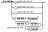

# Librairie Melody

Cette librairie instaure un système de notation simple mais complet, appelé MELO, afin d'écrire des mélodies (suite de notes musicales à une seule voix) dans le but de faciliter le pont entre la notation musicale et la génération du son.

## Raison d'être de la librairie

D'un côté, la notation musicale permet d'écrire une suite de notes, selon des standards connus depuis longtemps; on y utilise des lettres et des symboles afin de nommer les notes, spécifier des changements de rythmes ou des altérations (dièses, bémols), ou même des répétitions.

De l'autre côté, la génération d'un son avec Arduino (habituellement à l'aide d'un buzzer), doit plutôt être exprimé par la fréquence du son (en Hz), sa durée (en millisecondes) et son intensité sonore (qui dépend du matériel utilisé).

En tant que musicien, écrire de la musique pour Arduino, en terme de Hz et de millisecondes est définitivement un frein et alourdit l'écriture, tout en ne mettant pas à profit la notation musicale déjà très riche. La librairie Melody vient faire le pont entre les deux.

## La notation MELO

La notation MELO (pour Melody) est un format textuel qui permet l'écriture simplifié d'une mélodie à une voix. Cette notation s'inspire notamment de la notation musicale standard.

### Mélodie

La mélodie est la forme de base de la notation. Elle est formée d'une suite de note ou de groupe de notes, suivi de modificateur. On peut espacer ou non ces suites de notes ou groupes. Chaque modifieur viendra modifier la note ou le groupe de notes qui le précède.


#### Exemples

- "cdefgab"
- "c d e f  g a b"
- "c_ c c*"
- "c\* d\* e\* f\*" est équivalent à "(cdef)\*"

### Note

Une note est représenté par une lettre (majuscule ou minuscule), selon la nomenclature standard C (do), D (ré), E (mi) F (fa), G (sol), A (la), B (si). On ajoute également la lettre R (rest) pour les silences. Par défaut, les notes sont celles de la 4e octave, où la note LA est de fréquence 440 Hz; elles ont toutes une durée relative de 1, correspondant à une noire en notation musicale standard.


#### Exemples

- "c d r" est équivalent à "C D R"

### Group

Un groupe permet facilement d'appliquer un modifieur à toute une mélodie d'un seul coup, afin d'alléger l'écriture. Un groupe est délimité par une paire de parenthèses.


#### Exemples
- "(cde)#" est équivalent à "c# d# e#"
- "(efg)\*-" est équivalent à "e\*- f\*- g\*-"
- "((abc#)-)x2 est équivalent à " a- b- c#- a- b- c#-"

### Modifier

Un modifieur est une suite d'altération qui permet de modifier la hauteur, la durée, le nombre de répétition ou l'intensité sonore d'une note ou d'un groupe de notes. On peut spécifier plusieurs modifieurs de suite; ils ont la propriétés d'être commutatif, c'est-à-dire que l'ordre dans lequel on les écrit n'aura pas d'importance.


#### Exemples
- "c+"  do 2 fois plus long
- "(cde)x3" équivalent à "cdecdecde"
- "d#"  ré, demi-ton plus haut
- "e_"  mi, une octave plus bas
- "a*_" la sans modification, car un octave plus haut et un octave plus bas s'annule
- "b_>" si, un octave plus bas et plus doux

### Pitch

Un modifieur de hauteur du son permet d'augmenter ou d'abaisser une note d'un demi-ton ou d'un octave.


- "c#"  do, un demi-ton plus haut
- "d*"  ré, une octave plus bas
- "e,"  mi, un demi-ton plus bas
- "f_" fa, une octave plus bas

### Duration

Un modifieur de durée permet de multiplier la durée d'une note par un facteur simple (2, 1/2 ou 3/2); il permet aussi de spécifier plus précisément n'importe quel type de pondération du temps (par exemple, pour les triolets). Par défaut, les notes ont toutes une durée de 1.



- "c+"  do 2 fois plus long, équivalent à une blanche
- "c-"  do 2 fois plus court, équivalent à une croche
- "c."  do 1.5 fois plus long, équivalent à une noire pointée
- "(ccc)/3:1" équivalent à un triolet de do, (trois notes de durée 1/3 chacun) 

### Repetition

Un modifieur de répétition permet de spécifier un nombre de répétition consécutifs pour la note ou le groupe de notes concernés.


- "(cde) x 3" équivalent à "cdecdecde"
- "( a X2 ef)x2" équivalent à "aaefaaef"

### Loudness

Un modifieur d'intensité sonore permet d'augmenter ou de diminuer la force du son. Une note a, par défaut, une intensité de 0; on peut donc avec des valeurs positives ou négatives. Puisque l'intensité sonore réelle dépend du matériel utilisé, il est suggéré d'utiliser une échelle relative allant de -3 (ppp) à +3 (fff).


- "c>>>" do très très doux (ppp), loudness = -3
- "d>>" ré très doux (pp),  loudness = -2
- "e>" mi doux (p),  loudness = -1
- "f" fa normal, loudness = 0
- "g<" sol fort (f), loudness = 1
- "a<<" la très fort (ff), loudness = 2
- "b<<<" si très très fort (fff), loudness = 3

### Integer

Un nombre entier doit être strictement positif (ne peut pas valoir zéro).


- "1" est valide
- "001" est valide
- "123" est valide
- "0" est invalide
- "000" est invalide

### Space

Les espaces permis incluent les caractères couramment utilisé comme espaceur; on y ajoute la barre verticale '|', car elle est souvent utilisée en notation musicale pour repérer les mesures et faciliter la lecture pour l'utilisateur. Ces espaces sont facultatifs et sont ignorés lors du décodage du texte.


-" | cdec | cdec | " est équivalent à "cdeccdec"

## Utilisation

```cpp
#include <Melody.h>

const uint8_t PIN_BUZZER = 12;

Melody melody(PIN_BUZZER);


void setup() {
  melody.setScore("c d e f g a c*");  //May be changed whenever you want
  melody.setTempo(120);               //May be changed whenever you want
}

void loop() {
 

  melody.restart();

  while(melody.hasNext()){
    melody.next();

    unsigned int freq = melody.getFrequency(); 
    unsigned long duration = melody.getDuration();
    int loudness = melody.getLoudness();

    freq > 0 ? tone(pin,freq,duration) : noTone();

    // loudness could be use with a mapping, according to your buzzer or sound-producing hardware
    //For Example :
    /*
      { 
        int realIntensity = map(loudness, -4, 4, 0, 1024);
        myBuzzer.setIntensity(realIntensity);
      }


    */

  }
}

```

## Constructeurs
```cpp
Melody();
Melody(char* score);
Melody(char* score, unsigned int tempo);
```

On peut spécifier dès le départ le score et le tempo, au besoin.

---
```cpp
void setTempo(unsigned int tempo)
int getTempo()
```
Cette méthode permet de lire et modifier le tempo de la musique, qui correspond au nombre de temps musicaux durant une minute. Par exemple, un tempo de 120 signifie qu'il y aura 120 notes de 1 temps joué durant 1 minute - ou que chaque note durera 0.5 seconde.

---
```cpp
bool setScore(char *score)
```
Cette méthode permet de modifier le score du Melody, soit une chaîne de texte formaté selon la notation MELO. Le score est automatiquement décodé et la valeur TRUE est retourné si le décodage n'a pas rencontré d'erreurs.

```cpp
void restart()
```
Cette méthode permet de redémarrer la lecture de la mélodie.


---
```cpp
int length()
```
Cette méthode retourne le nombre total de notes dans la mélodie.

---
```cpp
bool hasNext()
```
Cette méthode permet de savoir s'il y a une prochaine note à lire dans la mélodie. On doit l'utiliser avec la méthode next();

---
```cpp
void next()
```
Cette méthode permet de passer à la prochaine note de la mélodie.

---
```cpp
int index()
```
Cette méthode retourne l'index de la note courante, en base zéro.

---
```cpp
 unsigned int getFrequency()
```
Cette méthode retourne la valeur en Hz de la note courante. Si la valeur est de zéro, cela signifie qu'il s'agit d'un silence.


---
```cpp
 unsigned long getDuration()
```
Cette méthode retourne la durée de la note courante, en millisecondes.

---
```cpp
 int getLoudness()
```
Cette méthode retourne l'intensité sonore relative de la note courante.


